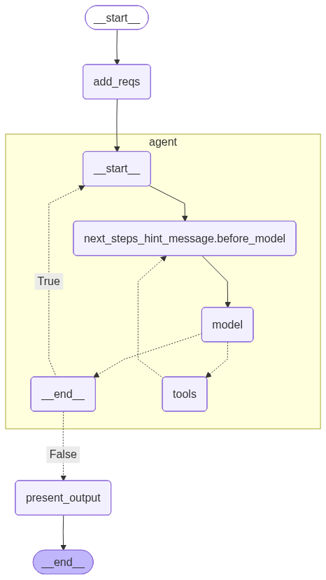

# AICE Catalyst Agent

This repository implements a small AI-driven "Catalyst" agent that converts free-form
business requirements into a structured, actionable project plan. The agent uses
LangChain-style tools and a state graph to iteratively parse requirements, generate
features and tasks, estimate complexity, and produce acceptance criteria and Copilot
prompts.



## Highlights

- State-driven agent built around a `ProjectPlanState` schema (see `src/structures.py`).
- Tools implemented in `src/tools.py` call an Azure LLM to produce structured outputs.
- A deterministic set of test tools is available in `src/test_tools.py` for offline testing.
- Entry point: `src/main.py` constructs the agent and runs the state graph.

## Quickstart (developer)

1. Create and activate a Python virtual environment (recommended):

```cmd
python -m venv .venv
.venv\Scripts\activate
```

2. Install the project in editable mode (this installs runtime dependencies declared in pyproject.toml):

```cmd
pip install -e .
```

3. Configure Azure credentials and any environment variables needed by `langchain_openai` (see the project's prompts and tools for expected env vars).

4. Run the sample agent using an example input file (the agent will print JSON output):

```cmd
python src\main.py
```

By default `src/main.py` reads from `examples/input2.txt` when executed as a script.

## Using the test tools

For deterministic behavior during development or CI, use the test tools in
`src/test_tools.py`. They implement the same function signatures as the real tools
but return fixed outputs (consistent feature/task ids) so you can validate agent
flows without calling the LLM.

To temporarily run the agent with the test tools, open `src/main.py` and replace the
`tools=[ ... ]` list with imports from `src.test_tools` (or add the test tools alongside
the real ones). This will exercise the state transitions end-to-end deterministically.

## Project structure

- `src/main.py` — builds and runs the agent and state graph
- `src/tools.py` — production tools that call the LLM (Azure)
- `src/test_tools.py` — deterministic test implementations of the same tools
- `src/structures.py` — Pydantic models describing the `ProjectPlanState` schema
- `src/control_flow.py` — helper functions used by the StateGraph
- `examples/` — example input and expected output files

## Notes and tips

- The state schema uses `typing.Annotated` to associate reducer functions (see `reduce_dict`
  in `src/structures.py`) with specific dict fields. The LangGraph state graph recognizes
  these reducers when merging multiple updates for the same key.
